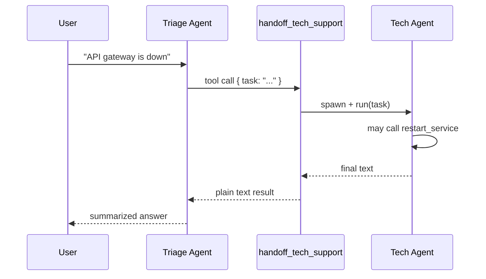

A **handoff** wraps another `Agent` as a tool. From the parent agent's perspective it's just another tool call — but internally kenpachi spins up the specialist, runs it to completion, and returns the answer as plain text.

This is the pattern behind "triage → billing / support / sales" flows, without writing routing logic yourself.

<Tip>
**Rule of thumb:** one front-door agent with handoff tools; each specialist owns its own tools and instructions (via provider system prompt or separate agent setup).
</Tip>

---

## Basic setup

```typescript
import { z } from "zod";
import { Agent, defineTool, handoff, createAnthropicProvider } from "kenpachi";

const provider = createAnthropicProvider({
  apiKey: process.env.ANTHROPIC_API_KEY!,
  model: "claude-sonnet-4-6",
});

// Specialist: billing — no tools needed for simple Q&A
const billingAgent = new Agent(provider, []);

// Specialist: tech support — has its own tools
const restartTool = defineTool({
  name: "restart_service",
  description: "Restart a named service",
  schema: z.object({ service: z.string() }),
  async execute({ service }) {
    return { service, status: "restarted" };
  },
});
const techAgent = new Agent(provider, [restartTool]);

// Handoffs become tools on the triage agent
const toBilling = handoff(billingAgent, "Use for billing, invoices, or payment questions", {
  id: "billing", // tool name → handoff_billing
});
const toTech = handoff(techAgent, "Use for outages, errors, or service restarts", {
  id: "tech_support",
});

const triageAgent = new Agent(provider, [toBilling, toTech]);

const result = await triageAgent.run("The API gateway is down, please help");
console.log(result.text);
// → Tech agent runs internally, parent summarizes the outcome.
```

The parent model decides **when** to delegate. You describe each specialist in the handoff's `description` — that's what the model reads to pick the right one.

---

## How it works internally



Key details:

- The sub-agent runs via `Agent.spawn()` — the parent's context and tools are **not** mutated.
- The handoff tool returns a **plain text string**, not a nested object.
- You can observe inner events with `onEvent` on the handoff options.

---

## Context modes

Control how much conversation history the specialist sees:

| Mode | What the sub-agent gets |
| :--- | :--- |
| `"full"` (default) | Entire parent message history (cloned) |
| `"summary"` | Last 6 text lines as a digest |
| `"none"` | Only the delegated `task` string |

```typescript
const toBilling = handoff(billingAgent, "Billing questions only", {
  id: "billing",
  context: "none", // specialist sees only the task, not prior chat
});
```

Use `"none"` for specialists that should stay focused. Use `"full"` when the specialist needs full thread context (e.g. "what did I ask earlier?").

---

## Observing delegation

```typescript
const toTech = handoff(techAgent, "Use for technical issues", {
  id: "tech_support",
  onEvent: (e) => {
    if (e.type === "tool_call") console.log("[tech]", e.name);
  },
  maxTurns: 6,
});

await triageAgent.run("Restart the gateway", {
  onEvent: (e) => {
    if (e.type === "tool_call") console.log("[triage] delegating via", e.name);
    if (e.type === "tool_result") console.log("[triage] got:", e.result);
  },
});
```

The handoff's `onEvent` fires for events **inside** the sub-agent run. The parent's `onEvent` sees the handoff as a normal tool call/result.

---

## When to use handoffs vs. one big agent

| One agent with many tools | Handoffs |
| :--- | :--- |
| Simpler for small apps | Scales when specialists have different tool sets |
| All tools visible to the model every turn | Parent only sees handoff descriptions — less confusion |
| Harder to tune per-domain behavior | Each specialist can use different providers/models later |

Start with one agent + tools. Add handoffs when the tool list grows or specialists need isolation.
